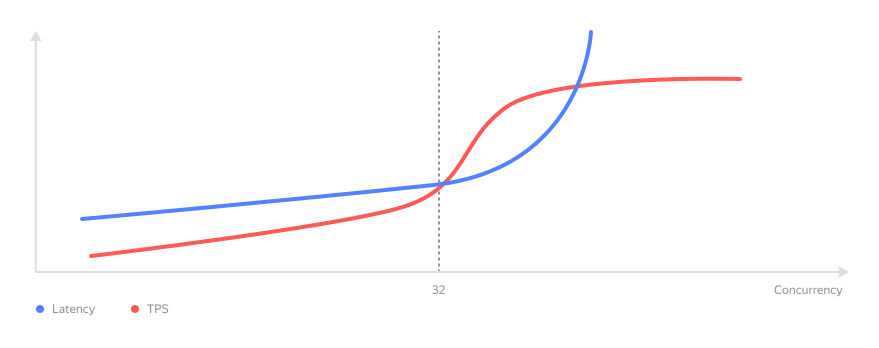

# Dedicated instances



With {{ foundation-models-name }}, you can deploy some models on a _dedicated instance_. Unlike a manual deployment on {{ compute-full-name }} VMs, you do not have to configure the environment or select optimal VM parameters. {{ foundation-models-name }} provides stable, reliable, and efficient model inference and monitors its operation automatically. 

Dedicated instances have a number of advantages:

* Guaranteed performance parameters that are not affected by other users' traffic.
* No additional quotas for requests and parallel generations. The restrictions you get only depend on the instance configuration you select.
* Optimized model inference for efficient hardware utilization.

Dedicated instances will benefit you if you need to process massive volumes of requests without delays. Dedicated instance is not [priced](../../pricing.md) based on the amount of incoming and outgoing tokens: you only pay for its running time. 

## Dedicated instance models {#models}

All deployed models are accessible via an API compatible with [{{ openai }}](../openai-compatibility.md), {{ ml-sdk-name }}, and in {{ ai-playground }}. To deploy a dedicated instance, you need the `ai.models.editor` [role](../../security/index.md) or higher for the folder. To access the model, it is enough to have the `ai.languageModels.user` role. 

#|
|| **Model** | **Context** | **License** ||
|| **Qwen 2.5 VL 32B Instruct**
[Model card](https://huggingface.co/Qwen/Qwen2.5-VL-32B-Instruct) | 4,096 | [Apache 2.0]({{ license-apache }}) license ||
|| **Qwen 2.5 72B Instruct** 
[Model card](https://huggingface.co/Qwen/Qwen2.5-72B-Instruct) | 16,384 | [Qwen license](https://huggingface.co/Qwen/Qwen2.5-72B-Instruct/blob/main/LICENSE) ||
|| **Gemma 3 4B it**
[Model card](https://huggingface.co/google/gemma-3-4b-it) | 4,096 | [Gemma Terms of Use]({{ license-gemma }})  ||
|| **Gemma 3 12B it**
[Model card](https://huggingface.co/google/gemma-3-12b-it) | 4,096 | [Gemma Terms of Use]({{ license-gemma }}) ||
|| **gpt-oss-20b** 
[Model card](https://huggingface.co/openai/gpt-oss-20b) | 128,000 | [Apache 2.0]({{ license-apache }}) license ||
|| **gpt-oss-120b** 
[Model card](https://huggingface.co/openai/gpt-oss-120b) | 128,000 | [Apache 2.0]({{ license-apache }}) license  ||
|| **T-pro-it-2.0-FP8** 
[Model card](https://huggingface.co/t-tech/T-pro-it-2.0-FP8) | 40,000 | [Apache 2.0]({{ license-apache }}) license ||
|#

## Dedicated instance configurations {#config}

Each model may be available for deployment in several configurations: **S**, **M**, or **L**. Each configuration guarantees specific values ​​of TTFT (_time to first token_), _Latency_ (time it takes to generate a response), and TPS (_tokens per second_) for requests with different context lengths.

The figure below shows the dependence of latency and the number of tokens processed by the model on the number of parallel generations (Concurrency in the figure): up to a certain point, the more generations the model processes in parallel, the longer the generation will last, and the more tokens will be generated per second.

