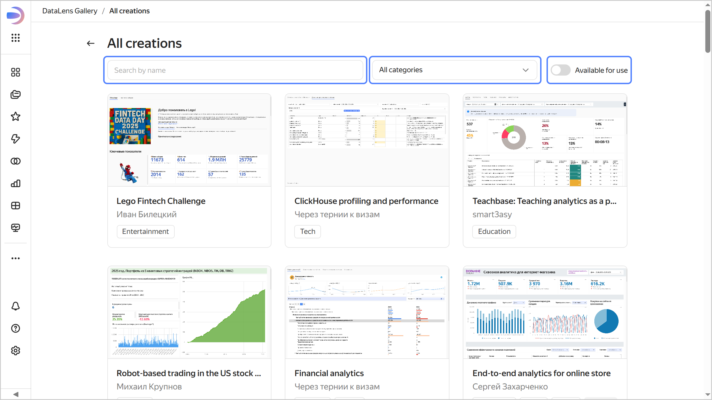
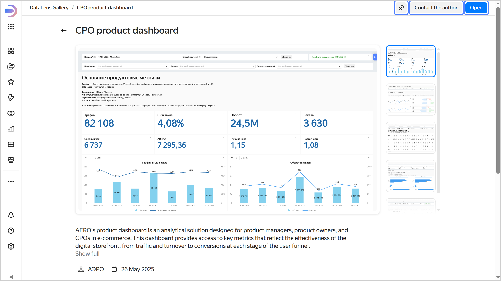
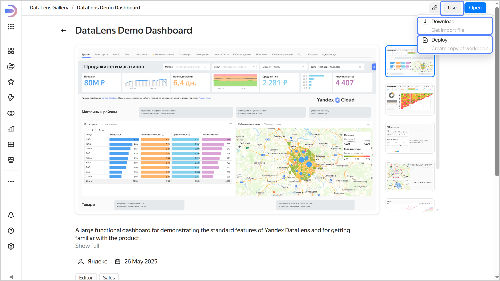
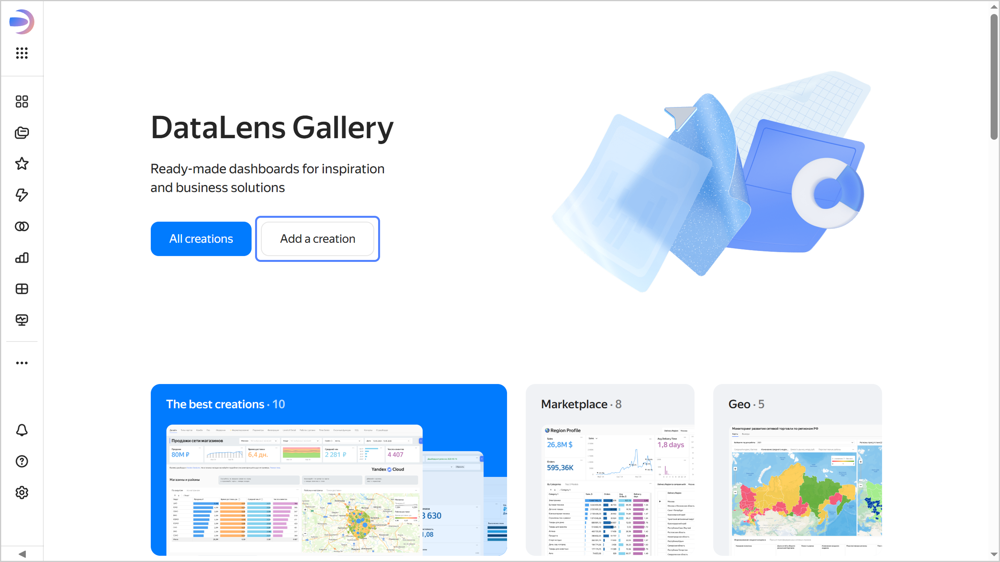

# {{ datalens-gallery }}

[{{ datalens-gallery }}](https://datalens.ru/gallery) is a gallery of ready-made dashboards for your inspiration and business needs.

The contributions featured in {{ datalens-gallery }} are provided not only by the {{ datalens-full-name }} team but also its users. Explore the diverse solutions created by other analysts and try implementing them in your projects.

In {{ datalens-gallery }}, you can:

* [Search](#search) for dashboards.
* [View](#review) the contributors’ creations.
* [Deploy](#deploy) them in your {{ datalens-name }} or export to other enviornments. Some dashboards do not support this option.
* [Add](#suggest) your own creation.

## Searching for dashboards {#search}

On the gallery [home page](https://datalens.ru/gallery), you can find the **Creation of the month**, a selection of the best creations, and creations on popular topics.

All creations are sorted into categories from the constantly evolving category list:
* Industry domain: `Healthcare`, `Education`, `Entertainment`.
* Application: `Product management`, `Marketing`, `Production`.
* Features: `Editor` usage, `Geoanalytics`, `English` (for creations in English).

On the [page with the list of all creations](https://datalens.ru/gallery/all), you can search for dashboads by name, filter them by category, or only display creations available for use.





## Viewing dashboards {#review}

To view a dashboard:

1. Click the dashboard card.
1. In the top-right corner, click **Open**. This will open a fully functional {{ datalens-name }} dashboard. You can apply selectors, switch between tabs, etc., depending on the dashboard’s features configured by its creator.

In some cases, you can contact the creator directly using the **Contact the author** button in the top-right corner.

To share a dashboard, copy its link using the  button.





## Using dashboards {#deploy}

Some creators consented to make their dashboards available for use. To conveniently search for such dashboards, toggle the **Available for use** switch on the [page with all creations](https://datalens.ru/gallery/all).

There are two ways you can use creations from {{ datalens-gallery }}:
* Deploy them in your {{ datalens-name }} instance: this will create a copy of the workbook with all its objects.
* Download a JSON export file and import it to a third-party {{ datalens-name }} environment: {{ datalens-name }} Open Source or {{ datalens-name }} Enterprise.



You can deploy a dashboard in your {{ datalens-name }} instance if you enable [workbooks and collections](../workbooks-collections/index.md#enable-workbooks).



To deploy a dashboard in your {{ datalens-name }} instance:
1. Click the dashboard card.
1. Click **Use** → **Deploy**.
1. Choose where to save the workbook: workbook and collection root, existing collection, or new collection. Navigate to the saving location and click **Deploy**. The workbook name must be unique, so edit the name if you need to.
1. Click **Create**.

To download the export file:
1. Click the dashboard card.
1. Click **Use** → **Download**. The workbook will be downloaded as a JSON file.
   Import the workbook using [this guide](../workbooks-collections/export-and-import.md#import-workbook).





## Adding your creation {#suggest}

To add your creation to {{ datalens-gallery }}, click **Add a creation** on the [gallery home page](https://datalens.ru/gallery) and fill out the form:

* Contact details. If you participate in the [{{ yandex-cloud }}]({{ link-cloud-partners-landing }}) partner program and provide the email you are using to authenticate there, your dashboard will be displayed with the **Contact the author** button, and users will be able to contact you directly.
* Name, description, and category for your creation.
* Link to the dashboard with [public access](./datalens-public.md).
* [Exported workbook](../workbooks-collections/export-and-import.md#export-workbook) file.
* Screenshots for the dashboard card. Screenshot requirements:
   * Dashboard only, no excessive UI or browser elements.
   * Screenshots should be made with the `_embedded=1` aprameter in the URL as well as `_theme=light` or `_theme=dark`, respectively, for the light or dark them. Here is an example of such a link: `https://datalens.yandex/9fms9uae7ip02?_embedded=1&_theme=light`.
   * Resolution: 1920×1080.
   * File format: PNG.




