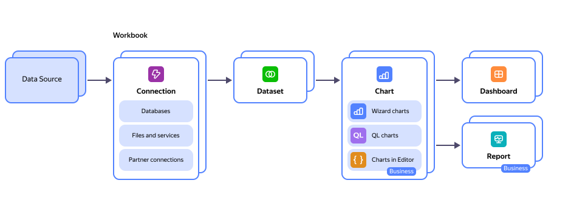

# About {{ datalens-full-name }}

{{ datalens-full-name }} is a business analytics tool that allows you to connect to various data sources, visualize data, create dashboards, reports, presentations, and share your results. With {{ datalens-short-name }}, you can track your product and business metrics directly from data sources to make data-driven decisions.

For usage examples, see [{{ datalens-gallery }}]({{ link-datalens-main }}/gallery).

## How {{ datalens-short-name }} works {#how-dl-works}

{{ datalens-short-name }} features the following entities:

* **Connection**: Parameters for accessing a data source.
* **Dataset**: Description of a dataset from a source.
* **Chart**: Data from a data source or dataset visualized as tables, diagrams, or maps.
* **Dashboard**: Complex visualization made up of charts and selectors for filtering data as well as text blocks, automatically optimized for mobile devices.
* **Report**: Document designed as an interactive presentation, where you can add charts, text blocks, headers, and images and then export it to PDF. Reports are available with the _Business_ [service plan](../../datalens/pricing.md#service-plans).

{{ datalens-short-name }} uses workbooks and collections to organize objects. Workbooks store connections, datasets, charts, and dashboards. Collections group workbooks and other collections for streamlined data management and navigation.

{{ datalens-short-name }} offers three tools for creating charts (graphs, tables, and maps):

* [**Wizard**](./chart/dataset-based-charts.md) is a tool familiar to users of Tableau, Power BI, and similar platforms. It enables you to create datasets and visualize their data in a GUI by means of formulas and drag-and-drop field placement.

* [**QL charts**](chart/ql-charts.md) help you render a chart by running a query to your data source.

* [**Editor**](../charts/editor/index.md) is designed for creating data visualization widgets with JavaScript. In Editor, you can use data from various [sources](../charts/editor/sources.md) and process it as you like, which makes it a very flexible tool. Only available in the Business plan.

You can add your charts to [dashboards](./dashboard.md) or [reports](../reports/index.md), enhance them with control elements, such as selectors, headers, images, or tooltips, and share your work with your colleagues and team.

