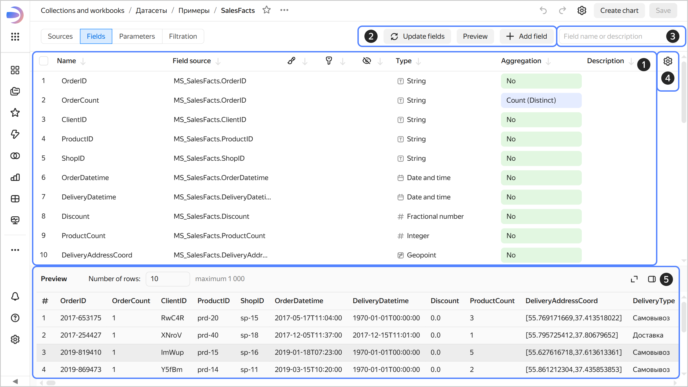
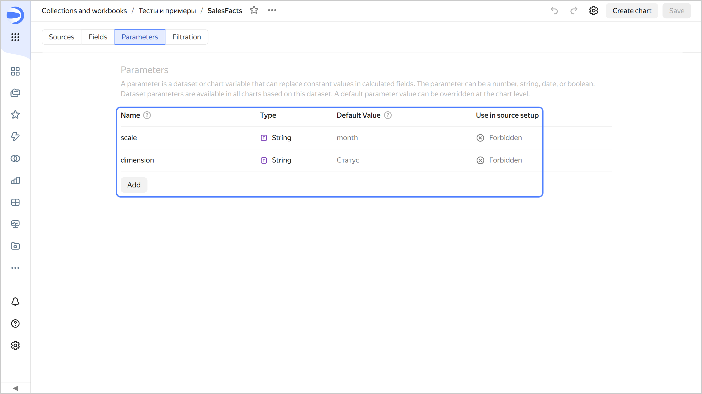

# Dataset in {{ datalens-name }}

A _dataset_ describes a set of data and its structure. Data in a dataset is represented as fields.

{{ datalens-short-name }} creates a dataset based on a data source for which there is a [connection](../concepts/connection.md).

A dataset works with sources in direct access mode: it runs all data queries on the source side. At the same time, you cannot change data in the source itself using {{ datalens-short-name }}.



## Dataset page {#dataset-page}

A dataset page consists of several tabs:



- _Sources_ tab

  1. Connections panel. Displays the connection to the data source the dataset is based on.
  1. Tables panel. Contains a list of tables available in the data source.
  1. Workspace. You can drag here the tables you need and set up links between them.
  1. Preview area. Here you can see what the dataset's content will look like. You can [disable](./settings.md#preview-default) the default preview display.
  1. **Preview** button. Hides or shows the preview area.

     

- _Fields_ tab

  1. Presents a list of fields. [Fields](./data-model.md#field) that define the structure and format of the dataset.
  1. Buttons. You can use these to [create](./create-dataset.md#create-fields) a new field, [update](./create-dataset.md#update-fields) existing ones, and hide the preview area.
  1. Search bar. Allows you to find a field by its name.
  1. Additional settings. Allows customizing the way fields are presented in the list.
  1. Preview area. Here you can see what the dataset's content will look like. You can [disable](./settings.md#preview-default) the default preview display.

     

- _Parameters_ tab

  The tab displays the [parameters](../concepts/parameters.md) created at the dataset level. Here you can [add a new parameter](../dataset/create-dataset.md#add-parameters) or edit an existing one.

  

- _Filtering_ tab

  The tab displays [filters](./settings.md#default-filters) applied to all new charts built based on the current dataset. Here you can [create a new filter](../dataset/create-dataset.md#add-filters) or edit an existing one.

  



#### See also {#see-also}

* [{#T}](./create-dataset.md)
* [{#T}](./data-model.md)
* [{#T}](./data-types.md)
* [{#T}](./settings.md)
* [{#T}](../tutorials/data-from-ch-dataset-parametrization.md)