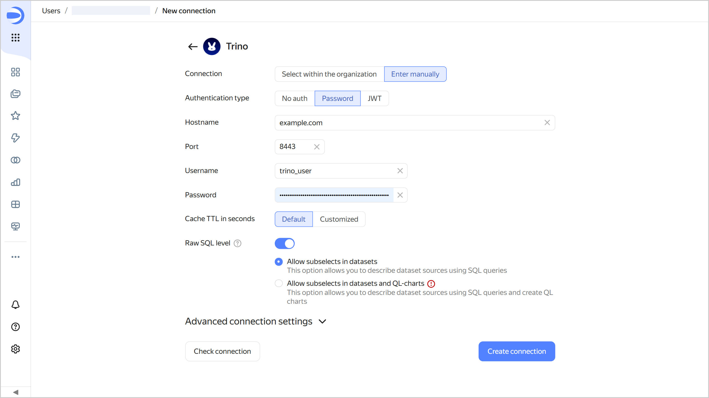
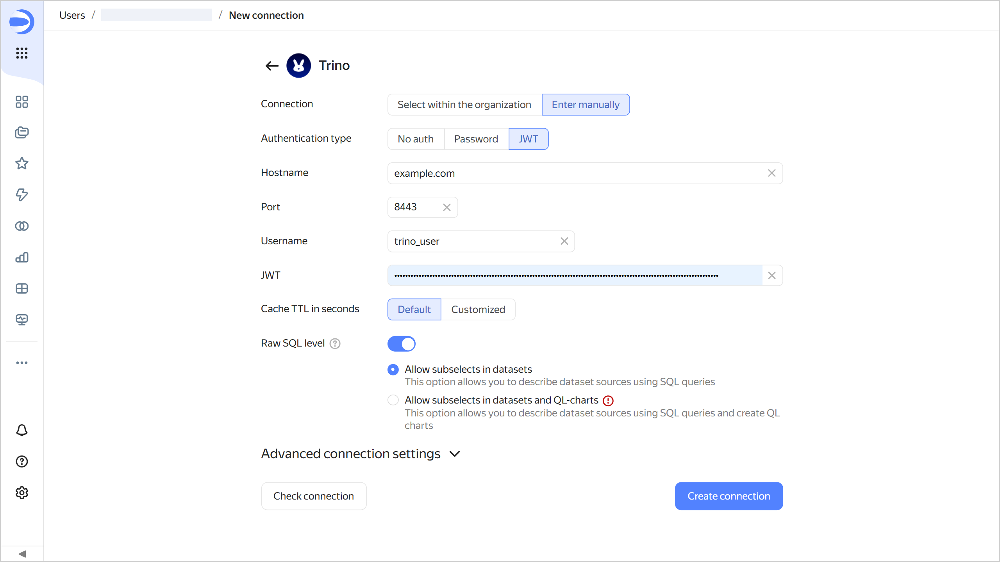
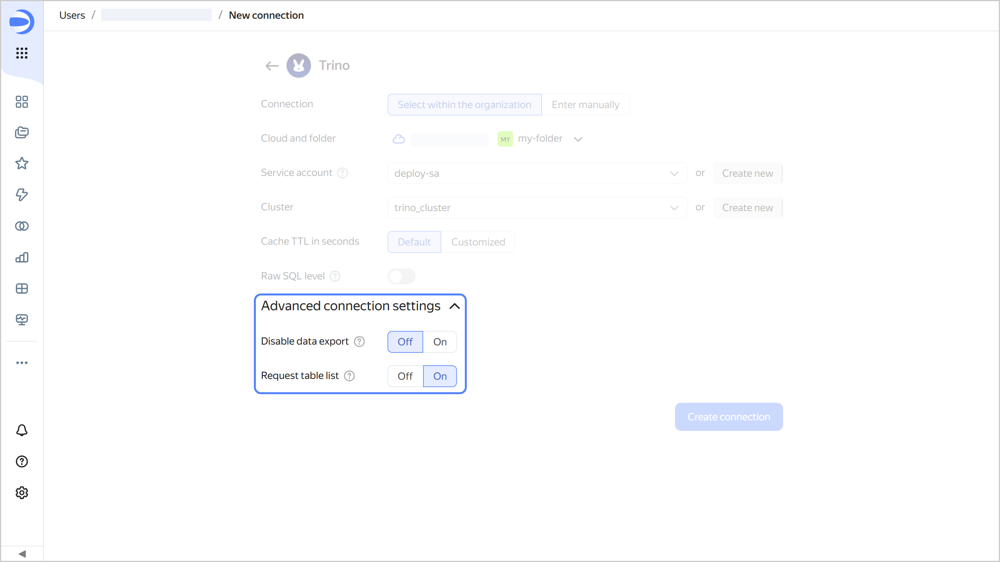

# Creating a {{ TR }} connection

To create a {{ TR }} connection:

1. Open the page for [creating a new connection]({{ link-datalens-main }}/connections/new).
1. Under **Databases**, select the **{{ TR }}** connection.
1. Select the connection type:

   

   - Select in organization {#organization}

     

     * **Cloud and folder**. Select the folder where your service account will be located.
     * **Service account**. Select an existing service account or create a new one.
     * **Cluster**. Specify a cluster from the list of available {{ TR }} clusters or create a new one.
     * **Cache TTL in seconds**. Specify the cache time-to-live or leave the default value. The recommended value is 300 seconds (5 minutes).

     

     

   - Specify manually {#manual}

     Select the authentication mode and manually specify the external database credentials to connect via a public network:

     

     - Without authentication {#noauth}

       * **Hostname**. Specify the {{ TR }} coordinator path or IP address.
       * **Port**. Specify the {{ TR }} connection port. The default port is 8443.
       * **Username**. Specify the username for the {{ TR }} connection. (If authentication is disabled, you can use any username as it will not affect the connection. The field value will be sent together with requests to the source.)
       * **Cache TTL in seconds**. Specify the cache time-to-live or leave the default value. The recommended value is 300 seconds (5 minutes).

       

       

     - Password {#password}

       * **Hostname**. Specify the {{ TR }} coordinator path or IP address.
       * **Port**. Specify the {{ TR }} connection port. The default port is 8443.
       * **Username**. Specify the username for the {{ TR }} connection.
       * **Password**. Enter the password for the specified user.
       * **Cache TTL in seconds**. Specify the cache time-to-live or leave the default value. The recommended value is 300 seconds (5 minutes).

       

       

     - JWT {#jwt}

       * **Hostname**. Specify the {{ TR }} coordinator path or IP address.
       * **Port**. Specify the {{ TR }} connection port. The default port is 8443.
       * **Username**. Specify the username for the {{ TR }} connection.
       * **JWT**. Specify a JWT.
       * **Cache TTL in seconds**. Specify the cache time-to-live or leave the default value. The recommended value is 300 seconds (5 minutes).

       

       

     

     Optionally, test the connection. To do this, click **Check connection**.
     
   

1. Click **Create connection**.
1. Select a [workbook](../../workbooks-collections/index.md) to save your connection to or create a new one. If using legacy folder navigation, select a folder to save the connection to. Click **Create**.
1. Enter a name for the connection and click **Create**.

## Additional settings {#additional-settings}

You can specify additional connection settings in the **Advanced connection settings** section:



- Select in organization {#organization}

  * 
  * 

     

- Specify manually {#manual}

  * **TLS**: If this option is enabled, {{ TR }} is accessed via `HTTPS`; if not, `HTTP`.
  * **CA Certificate**: To upload a certificate, click **Attach file** and specify the certificate file. When the certificate is uploaded, the field shows the file name.
  * 
  * 

  



## Connecting an external database {#external-db-connection}


