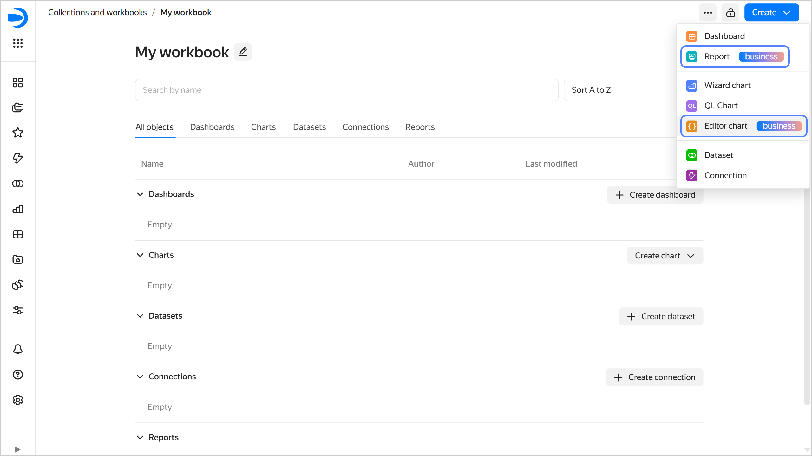
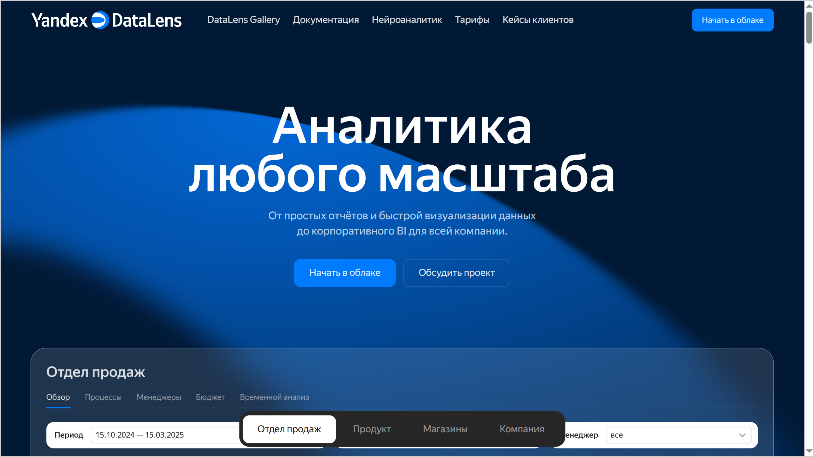

# {{ datalens-full-name }} release notes: September 2025

* [Changes in basic features](#base)
* [Fixes and improvements](#fixes)
* [Changes available with the _Business_ service plan](#business)

## Changes in basic features {#base}

* Added [dataset](../dataset/versioning.md) versioning. You can now view a list of previously saved dataset changes and roll back to a previous version.
* In the chart [axis settings](../concepts/chart/settings.md#axis-settings), added the ability to select `Manually` for label formatting.
* When using a connection to [{{ PG }}](../operations/connection/create-postgresql.md), added the ability to provide `TODAY()` as the first argument for the `DATEADD` [function](../function-ref/DATEADD.md).
* Updated the settings form for calculated fields in datasets and charts: the field name is now displayed in a separate row.

* Added highlighting of features available with the Business [service plan](../concepts/service-plans-comparison.md) in some menus.

  

  

  

* Added a privacy policy: click  **Help center** → **Privacy policy** in the left-hand navigation panel.
* Implemented [adding chart info](../operations/chart/add-description.md) in the wizard, Editor, and in QL charts.
* Added the **Retry** button in the window with related objects; it appears when an error occurs on window opening.
* Now only a user with the `{{ roles-datalens-instances-admin }}` or `{{ roles-datalens-admin }}` [role](../security/roles.md#service-roles) can create a [{{ datalens-short-name }} Usage Analytics](../operations/connection/create-usage-tracking.md) connection. To allow other users to view a connection and run queries to it, the connection administrator can configure [object access permissions](../security/manage-access.md).
* Added a connection to [{{ TR }}](../operations/connection/create-trino.md). A connector enables you to connect either to a managed database in the current {{ yandex-cloud }} organization or to an external database with your own credentials and an option to select the authentication type.
* Modified the behavior of [signed parameters](../security/private-embedded-objects.md#signed-parameters) in private embeddings.

  * Now signed parameters take priority. If a widget gets both a signed and an external parameter of the same name at the same time, the signed one will apply.
  * Signed parameter selectors do not affect the dashboard charts.

### {{ datalens-full-name }} updates {#datalens-update}

Released a major {{ datalens-full-name }} update:

* Changed the domain to `datalens.ru`. It is now the single point of access where you can download the on-premise distribution, explore the product, or view a ready-to-use dashboard.

  Please note:

  * The promo page and {{ datalens-short-name }} itself are now available at `datalens.ru`.
  * The new secure embedding URL is `datalens.ru/embeds/*`. On October 9, we will enable redirection from the legacy secure embedding URLs to the new addresses. Make sure to make `datalens.ru` an allowed domain in the security settings of the website or application with embedded objects.
  * Public charts and dashboards are still available at `datalens.yandex`.

* Updated the design and contents of the {{ datalens-short-name }} promo page.

  

## Fixes and improvements {#fixes}

* Restored the ability to open a chart as a table. To open your chart as a table, click  →  **Open as a table** in the top-right corner of the chart.
* Fixed the incorrect closing of the settings window when editing a dashboard access error.
* Fixed the error where data export got implicitly [disabled](../dataset/create-dataset.md#data-export-disable) when editing a dataset.
* Fixed the error caused by attempts to save a selector in which a field could not be validated.
* Fixed incorrect name saving when [creating a calculated field](../concepts/calculations/index.md#how-to-create-calculated-field) in a chart.
* Fixed the issue where [disabling export](../concepts/chart/data-export.md#data-export-disable) at the connection or dataset level did not stop export from QL charts based on that connection or dataset. Now export from all charts will be blocked.
* Fixed incorrect behavior when adding to or deleting favorites in datasets and dashboards.

## Changes available with the _Business_ service plan {#business}

* Implemented the ability to [add a description to a report](../reports/report-operations.md#report-add-description).

### Neuroanalyst in {{ datalens-short-name }} {#ai-datalens}

Neuroanalyst in {{ datalens-short-name }} is now available to all users with the Business service plan, including the 30-day trial period.

Neuroanalyst comprises multiple AI assistants:

* [Neuroanalyst for calculated fields](../concepts/calculations/formulas-helper.md): Helps you to create calculated fields.
* [Neuroanalyst on your dashboard](../dashboard/insights.md): Neuroanalytics on your dashboard.
* [Neuroanalyst in Editor](../charts/editor/code-helper.md): Helps you to write code and search for answers to your questions.
* [Neuroanalyst in report](../reports/insights.md): Neuroanalytics in your report.

Data security and processing:

* Neuroanalyst is powered by the cloud service called [{{ foundation-models-full-name }}](../../ai-studio).
* Your data and queries do not leave {{ yandex-cloud }}, are not logged, nor used for model tuning.
* However, the user with the `{{ roles-datalens-admin }}` role may [disable](../concepts/neuroanalyst.md#prohibit) this option at the {{ datalens-short-name }} instance level or for individual dashboards.

### Background data export {#data-export}

In {{ datalens-short-name }}, added [background data export](../concepts/chart/data-export.md#background-export). You can now save large amounts of data from charts.

* Available only for [tables](../visualization-ref/table-chart.md) created in the [wizard](../concepts/chart/dataset-based-charts.md) with enabled pagination.
* Export file format is `CSV`.
* Minimum number of pages to export is two.
* Maximum number of rows in the table is 1,000,000.
* Maximum export file size is 1 GB.

For more information about the limitations, see [this section](../concepts/chart/data-export.md#restrictions).

To initiate a background export, do the following:

1. Open the data export window by doing one of the following:
   
   * Open the chart you want to export data from and click  →  **Save as** → **CSV** in its top-right corner.
   * On the dashboard, find the chart for data export and click  →  **Save as** → **CSV** in its top-right corner.

1. In the export window, under **Pages**, select `All`. Optionally, edit the following export file settings: **Value delimiter**, **Decimal separator**, and **Encoding**.
1. Click **Save**. At the bottom of your screen, you will see a message saying that the export has started and a link to the export page, where you can monitor the export status and details. Once the export is complete, you will get the **Chart export complete** message with links to the export page and file for download.

You can find the export history and files staged for download in the [Background data export]({{ link-datalens-main }}/exports) section.

