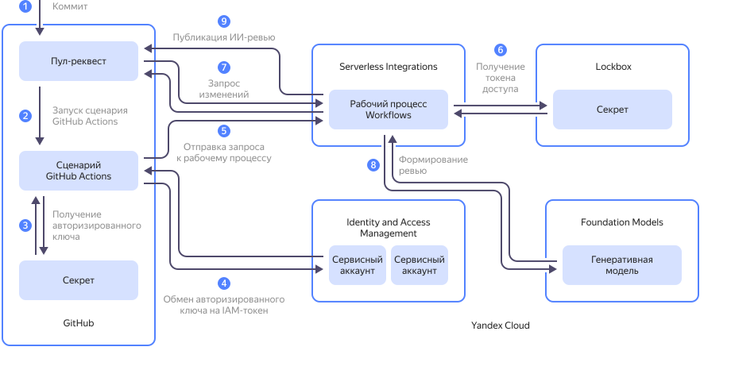
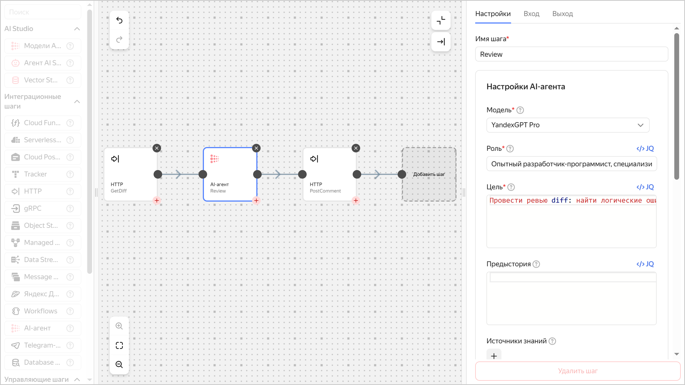

В этом руководстве вы воспользуетесь возможностями [моделей генерации текста](../../foundation-models/concepts/generation/models.md) {{ foundation-models-full-name }} для реализации сценария автоматического [ревью](https://docs.github.com/en/get-started/learning-about-github/github-glossary#review) предлагаемых изменений в программном коде на [GitHub](https://github.com/).

Предлагаемое решение использует сценарий [GitHub Actions](https://docs.github.com/en/actions/get-started/understand-github-actions), чтобы запросить в {{ yandex-cloud }} ИИ-ревью изменений в [пул-реквесте](https://docs.github.com/en/get-started/learning-about-github/github-glossary#pull-request). Процесс получения изменений, запрос формиирования ревью генеративной моделью и последующая публикация ревью на GitHub выполняются [рабочим процессом](../../serverless-integrations/concepts/workflows/workflow.md) {{ sw-full-name }}.



На схеме:

1. Пользователь добавляет [коммит](https://docs.github.com/en/get-started/learning-about-github/github-glossary#commit) в пул-реквест на GitHub.
1. После появления нового коммита в пул-реквесте запускается сценарий GitHub Actions.
1. Сценарий GitHub Actions получает [авторизованный ключ](../../iam/concepts/authorization/key.md) сервисного аккаунта {{ yandex-cloud }}, сохраненный в [секрете репозитория](https://docs.github.com/en/actions/how-tos/write-workflows/choose-what-workflows-do/use-secrets) на GitHub.
1. Сценарий GitHub Actions запрашивает [IAM-токен](../../iam/concepts/authorization/iam-token.md) в обмен на авторизованный ключ [сервисного аккаунта](../../iam/concepts/users/service-accounts.md) в сервисе {{ iam-full-name }}. IAM-токен необходим для аутентификации в API {{ si-full-name }}.
1. Сценарий GitHub Actions с использованием полученного IAM-токена отправляет рабочему процессу {{ sw-full-name }} HTTP-запрос на формирование ревью. При этом в рабочий процесс {{ sw-name }} передается номер пул-реквеста.
1. Рабочий процесс {{ sw-name }} получает в [секрете](../../lockbox/concepts/secret.md) {{ lockbox-full-name }} [токен доступа](https://docs.github.com/en/authentication/keeping-your-account-and-data-secure/managing-your-personal-access-tokens#about-personal-access-tokens) `personal access token (classic)` к репозиторию на GitHub.
1. Рабочий процесс {{ sw-name }} с использованием токена доступа получает в репозитории на GitHub изменения, предлагаемые в пул-реквесте.
1. Рабочий процесс {{ sw-name }} запрашивает у [модели](../../foundation-models/concepts/generation/models.md) {{ foundation-models-full-name }} формирование ревью изменений, предлагаемых в пул-реквесте. Модель возвращает сгенерированное ревью с комментариями и собственными предложениями по улучшению кода.
1. Рабочий процесс {{ sw-name }} с использованием токена доступа публикует полученное ревью в пул-реквесте на GitHub.

Чтобы настроить автоматическое ИИ-ревью пул-реквестов на GitHub:

1. [Создайте репозиторий на GitHub](#create-github-repo).
1. [Подготовьте облако к работе](#prepare-cloud).
1. [Создайте рабочий процесс {{ sw-name }}](#create-si-workflow).
1. [Настройте сценарий GitHub Actions](#github-actions-workflow).
1. [Протестируйте работу сценария](#test).

Если созданные ресурсы вам больше не нужны, [удалите их](#clear-out).

## Создайте репозиторий в GitHub {#create-github-repo}

[Создайте](https://docs.github.com/en/repositories/creating-and-managing-repositories/creating-a-new-repository) на GitHub новый репозиторий или используйте существующий, в котором у вас есть права на просмотр и запуск GitHub Actions.

[Создайте](https://docs.github.com/en/authentication/keeping-your-account-and-data-secure/managing-your-personal-access-tokens#creating-a-personal-access-token-classic) и сохраните токен доступа _personal access token (classic)_ с [областью доступа](https://docs.github.com/en/apps/oauth-apps/building-oauth-apps/scopes-for-oauth-apps#available-scopes) `repo` или `public_repo`.

## Подготовьте облако к работе {#prepare-cloud}



### Необходимые платные ресурсы {#paid-resources}

В стоимость поддержки инфраструктуры для реализации сценария автоматического ИИ-ревью пул-реквестов входят:
* плата за генерацию текста (см. [тарифы {{ foundation-models-full-name }}](../../foundation-models/pricing.md));
* плата за хранение секрета и операции с ним (см. [тарифы {{ lockbox-full-name }}](../../lockbox/pricing.md));
* плата за запись и хранение данных в [лог-группе](../../logging/concepts/log-group.md), если вы используете сервис [{{ cloud-logging-name }}](../../logging/) (см. [тарифы {{ cloud-logging-full-name }}](../../logging/pricing.md)).

### Создайте секрет {{ lockbox-name }} {#create-secret}

Создайте [секрет](../../lockbox/concepts/secret.md) {{ lockbox-full-name }}, в котором будет безопасно храниться токен доступа GitHub.



- Консоль управления {#console}

   1. В [консоли управления]({{ link-console-main }}) выберите каталог, в котором вы будете создавать инфраструктуру.
   1. В списке сервисов выберите **{{ ui-key.yacloud.iam.folder.dashboard.label_lockbox }}**.
   1. Нажмите кнопку **{{ ui-key.yacloud.lockbox.button_create-secret }}**.
   1. В поле **{{ ui-key.yacloud.common.name }}** введите имя секрета `github/pat-for-workflows`.
   1. В поле **{{ ui-key.yacloud.lockbox.forms.title_secret-type }}** выберите `{{ ui-key.yacloud.lockbox.forms.title_secret-type-custom }}`.
   1. В поле **{{ ui-key.yacloud.lockbox.forms.label_key }}** введите `token`.
   1. В поле **{{ ui-key.yacloud.lockbox.forms.label_value }}** введите полученный ранее на GitHub токен доступа `personal access token (classic)`.
   1. Нажмите кнопку **{{ ui-key.yacloud.common.create }}**.

  В результате откроется окно с таблицей, содержащей информацию о созданном секрете. Сохраните его идентификатор — он понадобится позднее при создании рабочего процесса.

- CLI {#cli}

  

  

  Выполните команду, указав полученный ранее на GitHub токен `personal access token (classic)`:

  ```bash
  yc lockbox secret create \
    --name github/pat-for-workflows \
    --payload '[{"key":"token","textValue":"<токен_доступа>"}]'
  ```

  Результат:

  ```text
  done (1s)
  id: e6q034pgt99k********
  folder_id: b1gt6g8ht345********
  created_at: "2025-08-20T15:39:05.873Z"
  name: github/pat-for-workflows
  status: ACTIVE
  current_version:
    id: e6quqngm8om0********
    secret_id: e6q034pgt99k********
    created_at: "2025-08-20T15:39:05.873Z"
    status: ACTIVE
    payload_entry_keys:
      - token
  ```

  Сохраните идентификатор созданного секрета (значение поля `secret_id`) — он понадобится позднее при создании рабочего процесса.

- API {#api}

  Воспользуйтесь методом REST API [create](../../lockbox/api-ref/Secret/create.md) для ресурса [Secret](../../lockbox/api-ref/Secret/index.md) или вызовом gRPC API [SecretService/Create](../../lockbox/api-ref/grpc/Secret/create.md).



### Создайте сервисные аккаунты {#create-sa}

Cоздайте два [сервисных аккаунта](../../iam/concepts/users/service-accounts.md):
* `workflow-sa` — от его имени будет выполняться [рабочий процесс](../../serverless-integrations/concepts/workflows/workflow.md) {{ sw-name }};
* `github-worker` — от его имени будет запускаться рабочий процесс при получении запроса от сценария GitHub Actions.

1. Создайте сервисный аккаунт `workflow-sa` и назначьте ему [роли](../../iam/concepts/access-control/roles.md) [`{{ roles-lockbox-payloadviewer }}`](../../lockbox/security/index.md#lockbox-payloadViewer) и [`ai.languageModels.user`](../../foundation-models/security/index.md#languageModels-user):

    

    - Консоль управления {#console}

        1. В [консоли управления]({{ link-console-main }}) выберите каталог, в котором вы создаете инфраструктуру.
        1. В списке сервисов выберите **{{ ui-key.yacloud.iam.folder.dashboard.label_iam }}**.
        1. Нажмите кнопку **{{ ui-key.yacloud.iam.folder.service-accounts.button_add }}**.
        1. Введите имя сервисного аккаунта `workflow-sa`.
        1. Нажмите кнопку  **{{ ui-key.yacloud.component.acl.update-dialog.button_add-role }}** и выберите роли [`{{ roles-lockbox-payloadviewer }}`](../../lockbox/security/index.md#lockbox-payloadViewer) и [`ai.languageModels.user`](../../foundation-models/security/index.md#languageModels-user).
        1. Нажмите кнопку **{{ ui-key.yacloud.iam.folder.service-account.popup-robot_button_add }}**.

    - CLI {#cli}

      1. Чтобы создать сервисный аккаунт, выполните команду:

          ```bash
          yc iam service-account create \
            --name workflow-sa
          ```

          Результат:

          ```text
          done (1s)
          id: aje4rh1vb737********
          folder_id: b1gt6g8ht345********
          created_at: "2025-08-21T13:49:54.097378917Z"
          name: workflow-sa
          ```

          Сохраните идентификатор созданного сервисного аккаунта (значение поля `id`) — он понадобится позднее при назначении роли и создании рабочего процесса.

      1. Чтобы назначить созданному сервисному аккаунту роль `lockbox.payloadViewer`, выполните команду:

          ```bash
          yc resource-manager folder add-access-binding <идентификатор_каталога> \
            --role lockbox.payloadViewer \
            --subject serviceAccount:<идентификатор_сервисного_аккаунта>
          ```

          Где:

          * `<идентификатор_каталога>` — [идентификатор каталога](../../resource-manager/operations/folder/get-id.md), в котором вы создаете инфраструктуру.
          * `<идентификатор_сервисного_аккаунта>` — сохраненный на предыдущем шаге идентификатор сервисного аккаунта.

          Результат:

          ```text
          done (2s)
          effective_deltas:
            - action: ADD
              access_binding:
                role_id: lockbox.payloadViewer
                subject:
                  id: aje4rh1vb737********
                  type: serviceAccount
          ```
      1. Аналогичным образом назначьте созданному сервисному аккаунту роль `ai.languageModels.user`.

    - API {#api}

      Чтобы создать сервисный аккаунт, воспользуйтесь методом REST API [create](../../iam/api-ref/ServiceAccount/create.md) для ресурса [ServiceAccount](../../iam/api-ref/ServiceAccount/index.md) или вызовом gRPC API [ServiceAccountService/Create](../../iam/api-ref/grpc/ServiceAccount/create.md).

      Чтобы назначить сервисному аккаунту роль на каталог, воспользуйтесь методом REST API [updateAccessBindings](../../resource-manager/api-ref/Folder/updateAccessBindings.md) для ресурса [Folder](../../resource-manager/api-ref/Folder/index.md) или вызовом gRPC API [FolderService/UpdateAccessBindings](../../resource-manager/api-ref/grpc/Folder/updateAccessBindings.md).

    

1. Аналогичным образом создайте сервисный аккаунт `github-worker` и назначьте ему [роль](../../iam/concepts/access-control/roles.md) `serverless.workflows.executor`.

### Создайте авторизованный ключ сервисного аккаунта {#create-authorized-key}

Создайте [авторизованный ключ](../../iam/concepts/authorization/key.md) для сервисного аккаунта `github-worker`. Авторизованный ключ позволит сценарию GitHub Actions получать IAM-токен для аутентификации в API {{ yandex-cloud }}.




- Консоль управления {#console}

  1. В [консоли управления]({{ link-console-main }}) выберите каталог, в котором вы создаете инфраструктуру.
  1. В списке сервисов выберите **{{ ui-key.yacloud.iam.folder.dashboard.label_iam }}**.
  1. В открывшемся списке выберите сервисный аккаунт `github-worker`.
  1. На панели сверху нажмите кнопку  **{{ ui-key.yacloud.iam.folder.service-account.overview.button_create-key-popup }}** и выберите `{{ ui-key.yacloud.iam.folder.service-account.overview.button_create_key }}`.
  1. Нажмите кнопку **{{ ui-key.yacloud.iam.folder.service-account.overview.popup-key_button_create }}**.
  1. В открывшемся окне нажмите кнопку **{{ ui-key.yacloud.iam.folder.service-account.overview.action_download-keys-file }}** и нажмите **{{ ui-key.yacloud.iam.folder.service-account.overview.popup-key_button_close }}**.

  В результате на ваш компьютер скачается файл `authorized_key.json`, содержащий авторизованный ключ. Сохраните его, он понадобится позднее для настройки GitHub Actions.

- CLI {#cli}

  Выполните команду:

  ```bash
  yc iam key create \
    --service-account-name github-worker \
    -o authorized_key.json
  ```

  В результате на вашем компьютере создастся файл `authorized_key.json`, содержащий авторизованный ключ. Сохраните его, он понадобится позднее для настройки GitHub Actions.

- API {#api}

  Воспользуйтесь методом REST API [create](../../iam/api-ref/Key/create.md) для ресурса [Key](../../iam/api-ref/Key/index.md) или вызовом gRPC API [KeyService/Create](../../iam/api-ref/grpc/Key/create.md).



## Создайте рабочий процесс {{ sw-name }} {#create-si-workflow}

Создайте [рабочий процесс](../../serverless-integrations/concepts/workflows/workflow.md) {{ sw-name }} на стороне {{ yandex-cloud }}.





1. Создайте файл `yawl-spec.yaml` со следующей [YaWL-спецификацией](../../serverless-integrations/concepts/workflows/yawl/index.md) рабочего процесса:

    **yawl-spec.yaml**

    ```yml
    yawl: '0.1'
    start: GetDiff
    steps:
      GetDiff:
        httpCall:
          url: >-
            https://api.github.com/repos/<имя_организации_на_GitHub>/<имя_репозитория>/pulls/\(.input)
          method: GET
          headers:
            Accept: application/vnd.github.v3.diff
            Authorization: Bearer \(lockboxPayload("<идентификатор_секрета>"; "token"))
          output: '\({diff: .})'
          next: Review
          catch: []
      Review:
        aiAgent:
          agentConfig:
            role: >-
              Опытный разработчик-программист, специализирующийся на ревью
              изменений в репозиториях на языке(ах) проекта.
            goal: >-
              Провести ревью diff: найти логические ошибки, уязвимости, проблемы
              со стилем, предложить улучшения и тесты.
            model:
              # Можно выбрать 'yandexgpt' или другую модель;
              name: <имя_модели>
          tasks:
            - result: >-
                Текст с комментариями для публикации на GitHub. Структура:

                1) Логические ошибки
                2) Потенциальные проблемы безопасности
                3) Стиль кода и мелкие замечания
                4) Предложения по тестам и рефакторингу
              description: 'Проведи ревью этих изменений: \(.diff)'
          output: '\({review: .Result})'
          next: PostComment
      PostComment:
        httpCall:
          # POST comment на issues (pull request comments проходят через issues API)
          url: >-
            https://api.github.com/repos/<имя_организации_на_GitHub>/<имя_репозитория>/issues/\(.input)/comments
          method: POST
          body: |-
            \({
              body: .review
            })
          headers:
            Authorization: Bearer \(lockboxPayload("<идентификатор_секрета>"; "token"))
            X-GitHub-Api-Version: '2022-11-28'
    ```

    Где:
    * `<имя_организации_на_GitHub>` — имя пользователя или организации — владельца репозитория на GitHub.
    * `<имя_репозитория>` — имя репозитория на GitHub.
    * `<идентификатор_секрета>` — сохраненный ранее идентификатор секрета {{ lockbox-name }}.
    * `<имя_модели>` — [имя модели](../../foundation-models/concepts/generation/models.md#generation) генерации текста {{ foundation-models-full-name }}. Например: `qwen3-235b-a22b-fp8`.

1. Создайте рабочий процесс:

    

    - Консоль управления {#console}

      1. В [консоли управления]({{ link-console-main }}) перейдите в каталог, в котором вы создаете инфраструктуру.
      1. В списке сервисов выберите **{{ ui-key.yacloud.iam.folder.dashboard.label_serverless-integrations }}**.
      1. На панели слева нажмите  **{{ ui-key.yacloud.serverless-workflows.label_service }}**.
      1. В правом верхнем углу нажмите **{{ ui-key.yacloud.serverless-workflows.button_create-workflow }}**.
      1. Выберите способ `{{ ui-key.yacloud.serverless-workflows.spec-editor-type_label_text-editor }}`.
      1. В редакторе кода вставьте содержимое созданного ранее файла `yawl-spec.yaml`.
      1. Раскройте блок **{{ ui-key.yacloud.serverless-workflows.label_additional-parameters }}**:
      1. В поле **{{ ui-key.yacloud.common.name }}** укажите имя рабочего процесса. Например: `github-ai-review-workflow`.
      1. В поле **{{ ui-key.yacloud.serverless-workflows.label_service-account }}** выберите созданный ранее сервисный аккаунт `workflow-sa`.
      1. (Опционально) [Настройте](../../serverless-integrations/operations/workflows/workflow/logs-write.md) логирование запусков рабочего процесса.
      1. Нажмите **{{ ui-key.yacloud.common.create }}**.

      В результате откроется окно с таблицей, содержащей информацию о созданном рабочем процессе. Сохраните его идентификатор — он понадобится позднее при настройке сценария GitHub Actions.

    - CLI {#cli}

      Выполните команду:

      ```bash
      yc serverless workflow create \
        --yaml-spec <путь_к_файлу_спецификации> \
        --name <имя_рабочего_процесса> \
        --service-account-id <идентификатор_сервисного_аккаунта> \
        --no-logging
      ```

      Где:

      * `--yaml-spec` — путь к созданному ранее файлу с YaWL-спецификацией. Например: `./yawl-spec.yaml`.
      * `--name` — имя создаваемого рабочего процесса. Например: `github-ai-review-workflow`.
      * `--service-account-id` — сохраненный ранее идентификатор сервисного аккаунта `workflow-sa`.
      * `--no-logging` — параметр, отключающий логирование запусков рабочего процесса. Необязательный параметр. Если параметр не задан, логи запусков рабочего процесса записываются в [лог-группу](../../logging/concepts/log-group.md) по умолчанию того каталога, в котором создан рабочий процесс.

      Результат:

      ```text
      done (4s)
      id: dfq58scovpo5********
      folder_id: b1gt6g8ht345********
      specification:
        spec_yaml: |-
        ...
      created_at: "2025-08-21T19:09:18.299850Z"
      name: github-ai-review-workflow
      status: ACTIVE
      log_options:
        disabled: true
      service_account_id: ajerhj18qmdd********
      ```

      Сохраните идентификатор созданного рабочего процесса (значение поля `id`) — он понадобится позднее при настройке сценария GitHub Actions.

    - API {#api}

      Чтобы создать рабочий процесс, воспользуйтесь методом REST API [Create](../../serverless-integrations/workflows/api-ref/Workflow/create.md) для ресурса [Workflows](../../serverless-integrations/workflows/api-ref/Workflow/index.md) или вызовом gRPC API [WorkflowService/Create](../../serverless-integrations/workflows/api-ref/grpc/Workflow/create.md).

    

## Настройте сценарий GitHub Actions {#github-actions-workflow}

1. В интерфейсе GitHub [создайте](https://docs.github.com/en/actions/how-tos/write-workflows/choose-what-workflows-do/use-secrets#creating-secrets-for-a-repository) секрет репозитория с именем `YC_SA_JSON_CREDENTIALS` и скопируйте в него содержимое полученного [ранее](#create-authorized-key) файла с авторизованным ключом.
1. Склонируйте ваш репозиторий, если это еще не сделано:

    ```bash
    git clone <URL_репозитория>
    ```
1. В локальной копии вашего репозитория создайте директорию `.github/workflows/` (если еще не создана) и создайте в этой директории файл `ai-review.yml`.
1. В файл `ai-review.yml` вставьте следующий код, указав в поле `workflowId` сохраненный ранее идентификатор рабочего процесса {{ sw-name }}:

    ```yaml
    name: Pull Request Automated Checks
    on:
      pull_request:
        branches:
          - main

    jobs:
      neuro-review:
        runs-on: ubuntu-latest
        steps:
          - name: Get IAM Token (Yandex)
            id: issue-iam-token
            uses: yc-actions/yc-iam-token@v1
            with:
              # в secrets храните JSON ключ авторизованного ключа SA
              yc-sa-json-credentials: $not_var{{ secrets.YC_SA_JSON_CREDENTIALS }}

          - name: Start Review Workflow
            uses: fjogeleit/http-request-action@v1
            with:
              url: 'https://serverless-workflows.api.cloud.yandex.net/workflows/v1/execution/start'
              method: 'POST'
              bearerToken: "$not_var{{ steps.issue-iam-token.outputs.token }}"
              data: |
                {
                  "workflowId": "<идентификатор_рабочего_процесса>",
                  "input": {
                    "inputJson": "$not_var{{ github.event.pull_request.number }}"
                  }
                }
    ```

1. Сохраните файл и отправьте изменения в удаленный репозиторий:

    ```bash
    git add . && git commit -m "Added ai-review.yml" && git push
    ```

## Протестируйте работу сценария {#test}

Чтобы проверить работу сценария, создайте новый пул-реквест в вашем репозитории на GitHub. При создании пул-реквеста, а также при каждой последующей отправке в пул-реквест нового коммита будет запускаться сценарий GitHub Actions, инициирующий создание на стороне {{ yandex-cloud }} ревью предлагаемых изменений и публикацию этого ревью в пул-реквесте.

## Удалите созданные ресурсы {#clear-out}

Чтобы перестать платить за созданные ресурсы:

1. [Удалите](../../lockbox/operations/secret-delete.md) секрет {{ lockbox-name }}.
1. [Удалите](../../serverless-integrations/operations/workflows/workflow/delete.md) рабочий процесс {{ sw-name }}.
1. [Удалите](../../logging/operations/delete-group.md) лог-группу, если вы включали логирование запусков рабочего процесса.
1. При необходимости [удалите](../../iam/operations/sa/delete.md) сервисные аккаунты.
