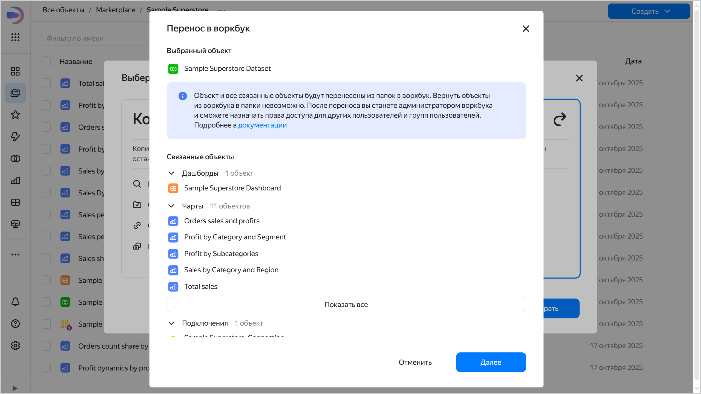
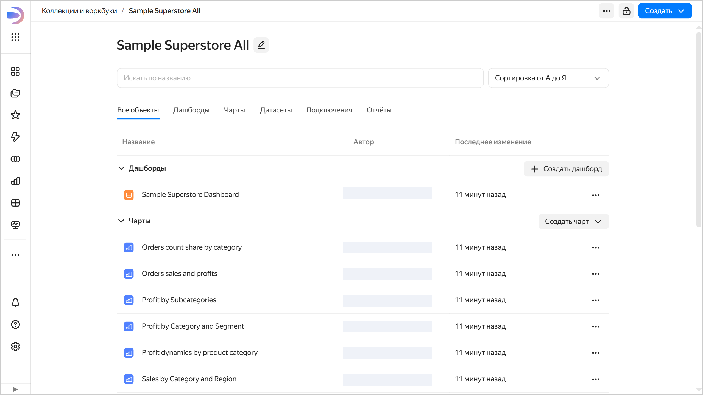

# Миграция объектов в воркбуки



* Если вы не видите на панели слева  **Коллекции и воркбуки**, [включите воркбуки и коллекции](../../datalens/workbooks-collections/index.md#enable-workbooks) в вашей организации.
* Выполнить миграцию может пользователь с ролью `{{ roles-datalens-admin }}`.
* Чтобы перенести воркбук между инсталляциями или [организациями](../concepts/organizations.md), воспользуйтесь инструментом [экспорта и импорта](./export-and-import.md).



Для миграции можно выбрать любой объект ([подключение](../concepts/connection.md), [датасет](../dataset/index.md), [чарт](../concepts/chart/index.md), [дашборд](../concepts/dashboard.md)) и выполнить ее способом [переноса](#migration-transfer) или [копирования](#migration-copy).

## Миграция переносом {#migration-transfer}

При выборе этого типа миграции объект переносится в [воркбук](./index.md) вместе со всеми связанными объектами:

* оригиналы объектов в папке не сохраняются;
* идентификаторы объектов остаются прежними;
* ссылки на объекты не меняются и ведут в воркбук.

Во время переноса {{ datalens-short-name }} находит связанные объекты рекурсивно по всем связям. Поэтому миграцию можно начать с любого объекта. Например, с дашборда. {{ datalens-short-name }} найдет все связанные чарты, датасеты и подключения. Затем для найденных объектов также выполнит поиск связей. В итоге все найденные объекты предложит сложить в один воркбук.



* Вернуть объекты из воркбука в папку невозможно.
* Сразу после миграции теряются все права доступа к перенесенным объектам, а вы становитесь единственным [администратором](../security/roles.md#datalens-workbooks-admin) воркбука и можете назначить [права доступа](./security.md) для других пользователей и групп пользователей.



## Миграция копированием {#migration-copy}

Если оригинал объекта нужно сохранить в папке, его можно скопировать в воркбук вместе со связанными объектами:

* оригиналы объектов в папке сохраняются;
* для скопированных объектов генерируются новые идентификаторы;
* ссылки на объекты не меняются.

Копирование можно начать с любого объекта. В отличие от переноса, поиск связанных объектов выполняется вниз по [иерархии](../concepts/index.md#component-interrelation), начиная с дашборда:

* с дашбордом копируются размещенные на нем чарты, а также датасеты и подключения, с которыми они связаны;
* с чартом копируются датасет и подключение, с которыми он связан;
* с датасетом копируется подключение, на котором он построен;
* подключение копируется отдельно.

Найденные объекты {{ datalens-short-name }} предложит сложить в один воркбук.



Копирование подключений [Файлы](../operations/connection/create-file.md), [Google Sheets](../operations/connection/create-google-sheets.md) и [Яндекс Документы](../operations/connection/create-yadocs.md) недоступно.



## Как мигрировать в воркбук {#migration-operation}

Чтобы копировать или перенести объект в воркбук:

1. На [странице навигации]({{ link-datalens-main }}/navigation) найдите объект, который хотите перенести или скопировать в воркбук.
1. Нажмите значок  у объекта и выберите  **Мигрировать в воркбук**.
1. Выберите способ миграции и нажмите кнопку **Выбрать**.
1. В открывшемся окне со списком связанных объектов нажмите кнопку **Далее**.
1. В открывшемся окне выберите воркбук, в который хотите перенести или скопировать объекты, и нажмите кнопку **Переместить**. Чтобы перенести или скопировать объекты в новый воркбук, нажмите кнопку **Создать воркбук**.
1. В окне **Управление доступом** настройте [права доступа к воркбуку](./security.md) и нажмите кнопку **Закрыть**.

## Копирование воркбука {#copy-workbook}

Если после миграции надо получить воркбук, содержащий только часть перенесенных объектов, вы можете создать копию воркбука и удалить из него все лишние объекты.

Рассмотрим создание воркбука с датасетом. В качестве исходных объектов будет использоваться [готовый набор данных]({{ link-datalens-main }}/marketplace/f2e0000r63qkp2ywqpco) вымышленной компании из {{ datalens-short-name }} {{ marketplace-short-name }}.

1. На [странице навигации]({{ link-datalens-main }}/navigation) найдите датасет **Sample Superstore Dataset**.
1. У датасета нажмите  →  **Мигрировать в воркбук**.
1. Выберите способ миграции `Перенос` и нажмите кнопку **Выбрать**.
1. В открывшемся окне вы увидите список связанных объектов, которые будут перенесены.

   

1. Нажмите кнопку **Далее**.
1. В открывшемся окне нажмите кнопку **Создать воркбук**. Введите название, например, **Sample Superstore All** и нажмите кнопку **Создать**. Выберите созданный воркбук в списке **Коллекции и воркбуки** и нажмите кнопку **Переместить**.
1. В окне **Управление доступом** настройте [права доступа к воркбуку](./security.md) и нажмите кнопку **Закрыть**.

   После миграции откроется воркбук **Sample Superstore All** с перенесенным датасетом и связанными объектами.

   

1. Создайте копию воркбука:

   1. На странице воркбука вверху нажмите  →  **Копировать**.
   1. В открывшемся окне выберите коллекцию, в которую хотите скопировать воркбук, и нажмите кнопку **Копировать**. Чтобы скопировать воркбук в новую коллекцию, нажмите кнопку **Создать коллекцию**.
   1. Введите название нового воркбука, например **Sample Superstore Copy**, и нажмите кнопку **Копировать**.

1. В воркбуке **Sample Superstore Copy** перейдите на вкладку **Все объекты** и удалите все, кроме подключения **Sample Superstore. Connection** и датасета **Sample Superstore Dataset**. Для этого у каждого объекта нажмите  →  **Удалить**.

Теперь воркбук **Sample Superstore Copy** содержит только подключение **Sample Superstore. Connection** и датасет **Sample Superstore Dataset**. Вы можете создать в воркбуке свои чарты и дашборд.

